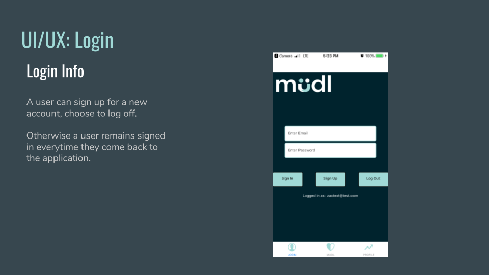
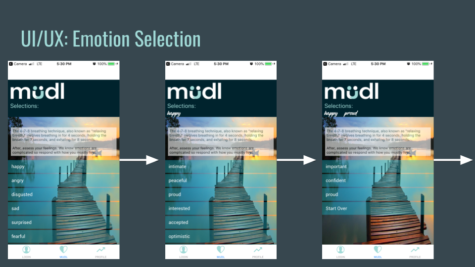
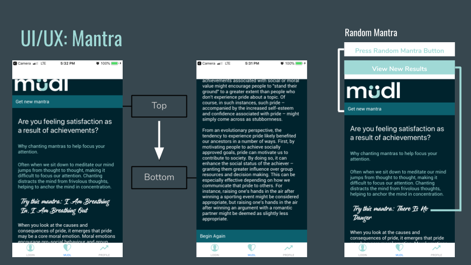
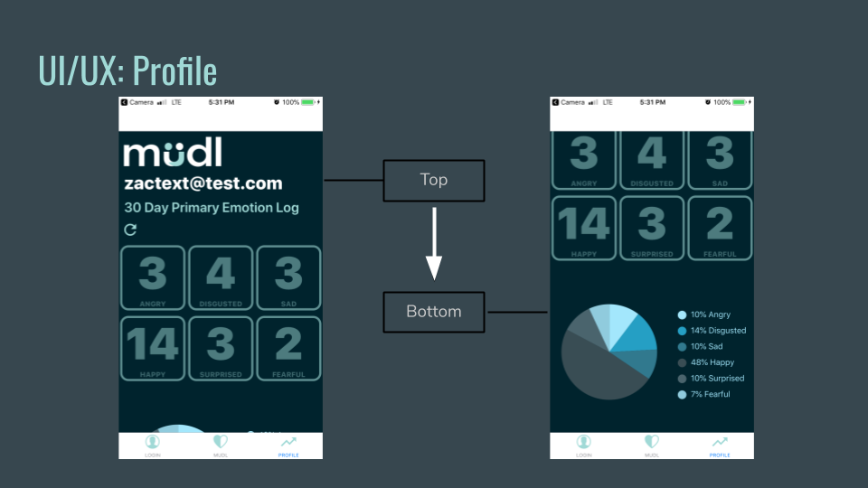

# mudl
MUDL allows a user to specify or identify latent emotions and deliver hyper-targeted solutions, mantras, psychological advice, and games based on the individual’s needs. By creating a unique search method where a user can quickly and easily navigate through over 1,080 unique endpoints on the app. 

## Motivation
To improve the over mental health of anyone seeking to get a better understanding of themselves and others.

## UI/UX

## Technologies Used:
MERN Stack
### Built With:
* React Native
* Expo-Cli
* MUDL API
  * PostgresSql
  * Express
  * Node

## Features
User profile that keeps track of your moods over the last month, randomly generated mantra with an option for additional mantras, an encyclopedia of where emotions derive based upon psychological studies and anecdotal evidence.

## Installation
### Prequisites
  you will need to have react-native and expo cli installed on your computer. Additionally you will need an androir or ios emulator to run the development environment. In exchange for have the emulators on your computer which using a lot of memory and make your computer run slower, you can also install the expo-client app from the android or apple store where you can take a picture of the qr code with your phone to run as a development enviroment.
 ### System Requirements
  * clone down the repository
  * npm install
  * npm install react-native-svg
  * cd /mudl
  * expo start
  
  
